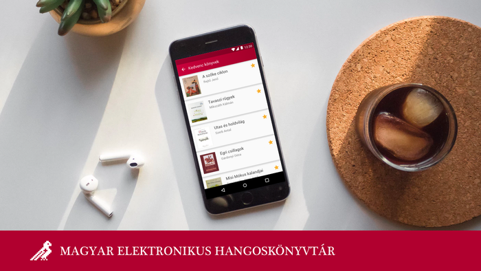

## E-könyvtár - A Magyar EKönyv és Hangoskönyv

This project is a mobile first initiative to preserve Hungarian language
and cultural heritage for future generations. With its mobile first approach,
it aims to create free Hungarian ebook reader, audiobook listener and catalog
app for the National Library of Hungary (MEK) to support mobiles, tablets,
Android Auto, Android Wear, Android TV and Google Cast devices.

### Contact and Support
If you have any questions, feel free to reach out to akos@murati.hu or check to our [privacy policy here](./audiobook-privacy_policy.md)
